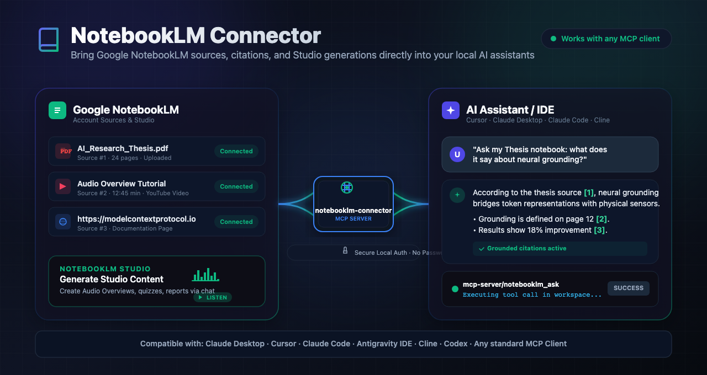
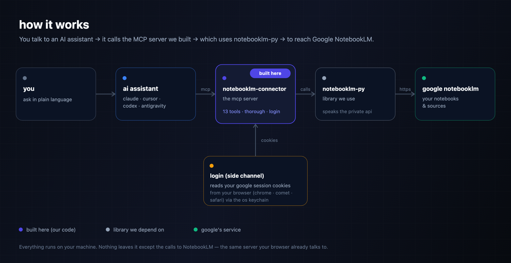

# NotebookLM Connector

[](https://notebooklmconnector.vercel.app) [](https://pypi.org/project/notebooklm-connector/) [](LICENSE)

**🌐 Website: [notebooklmconnector.vercel.app](https://notebooklmconnector.vercel.app)**



Bring your **Google NotebookLM** notebooks into **any AI assistant that speaks [MCP](https://modelcontextprotocol.io)** — Claude, Cursor, Codex, Antigravity IDE, Cline, and more. Ask questions answered only from your own sources (with citations), add sources, and generate Audio Overviews, reports, quizzes, and more — all from a normal chat.

## Install

Pick your app below. Then in a chat, say **“Connect my NotebookLM”**, choose your Google account, and you’re in — no password, ever.

> **One-time requirement:** the connector needs **Python 3.12** and **[uv](https://docs.astral.sh/uv/)** on the machine.
> Mac: `brew install python@3.12 uv` · Windows: [python.org](https://www.python.org/downloads/) + [uv install](https://docs.astral.sh/uv/getting-started/installation/).
> *(Claude Desktop’s `.mcpb` only needs Python — its runtime provides the rest.)*

### Claude Desktop — download & double-click

**[⬇️ Download NotebookLM-Connector.mcpb](https://github.com/asimhafeezz/notebooklm-connector/releases/latest)** → double-click it → **Install**. Done.

### Cursor — one click

[](https://cursor.com/install-mcp?name=notebooklm&config=eyJjb21tYW5kIjoidXZ4IiwiYXJncyI6WyItLXB5dGhvbiIsIjMuMTIiLCJub3RlYm9va2xtLWNvbm5lY3RvciJdfQ==)

### Codex — one line

```bash
codex mcp add notebooklm -- uvx --python 3.12 notebooklm-connector
```

### Claude Code — one line

```bash
claude mcp add notebooklm -- uvx --python 3.12 notebooklm-connector
```

### Google Antigravity

In the agent side panel: **⋯ → MCP Servers → Manage MCP Servers → View raw config**, then add the entry below. (Config file: `~/.gemini/config/mcp_config.json`.)

```json
{
  "mcpServers": {
    "notebooklm": { "command": "uvx", "args": ["--python", "3.12", "notebooklm-connector"] }
  }
}
```

### Any other MCP client (Antigravity IDE, Cline, …)

Add the same `mcpServers` entry shown above to the client’s MCP config.

Every non-Claude-Desktop option runs the same command, **`uvx --python 3.12 notebooklm-connector`**, which fetches the connector [from PyPI](https://pypi.org/project/notebooklm-connector/) — nothing to clone. (The `--python 3.12` is required — a dependency has no prebuilt wheel for Python 3.13 yet.)

> **Troubleshooting “Connection closed” / server won’t start:**
> - **Most common:** make sure the command includes `--python 3.12` (above). Without it, the install fails trying to compile on Python 3.13.
> - **“command not found”:** your app can’t find `uvx` on its PATH. Use the full path instead — find it with `which uvx` (e.g. `/opt/homebrew/bin/uvx`) and use that as the `command`.

## What you can ask

- *“Ask my Thesis notebook: what counterarguments do the sources discuss?”*
- *“Create a notebook called ‘Competitor research’ and add these three URLs as sources.”*
- *“Make an audio overview of my Onboarding notebook about deployment, then save it to my Desktop.”*
- *“Give me a quiz from my Biology notebook.”*
- *“Give me a **thorough** answer on the auth flow.”* — turns on auto-coverage (below).

That’s **13 tools** under the hood: connect/login, list & create notebooks, add sources (URLs, YouTube, text, files), ask questions with citations, and generate + download Studio content (audio, video, reports, quizzes, flashcards, mind maps, slide decks, infographics, data tables).

## Thorough mode (auto-coverage)

Ask for a *“thorough”* or *“complete”* answer and the connector runs **auto-coverage**: after the first answer, it asks NotebookLM which parts of your question weren’t fully covered, automatically asks those follow-ups, and returns one merged, more complete answer — all still cited to your sources.

Off by default (it uses several extra queries from the daily quota). Turn it on per question (“give me a thorough answer”), or always-on by setting `NOTEBOOKLM_THOROUGH=1` in the server’s env. Tune the depth with `NOTEBOOKLM_MAX_FOLLOWUPS` (default 3).

## Good to know

- **No password, ever** — the connector reuses the Google account you’re already signed into in your browser. On Mac, approve the one-time Keychain popup.
- **Sessions last ~2–4 weeks.** When it stops working, just say “Connect my NotebookLM” again.
- **Free NotebookLM accounts** allow about 50 questions per day.
- **It’s your own account** — use it as you normally would.
- **Unofficial** — this uses NotebookLM’s internal API (Google has no public one). It’s reliable but can break if Google changes things; updating usually fixes it.

## Browsers & operating systems

The connector logs in by reading your existing Google session from a browser. Which browsers work depends on your OS:

| Browser | macOS | Windows | Linux | Notes |
|---|:---:|:---:|:---:|---|
| Chrome, Brave, Edge, Chromium | ✅ | ✅ | ✅ | Easiest — one Keychain/OS prompt |
| Firefox, LibreWolf, Zen | ✅ | ✅ | ✅ | |
| Opera, Vivaldi | ✅ | ✅ | ✅ | |
| Arc | ✅ | ✅ | — | Not on Linux |
| **Comet** (Perplexity) | ✅ | — | — | macOS only |
| Safari | ✅ | — | — | Needs macOS **Full Disk Access** for the app |
| **Atlas** (OpenAI), and other *app-bound-encrypted* browsers | ❌ | ❌ | ❌ | Cookies are locked to the app — can’t be read (see below) |

> Developed and fully tested on **macOS**. The cross-platform browsers above also work on Windows/Linux (via [rookiepy](https://github.com/thewh1teagle/rookie)); Comet and Safari are macOS-only.

**On Linux (Ubuntu, etc.):** Chrome/Chromium/Brave/Edge/Firefox all work. Chromium stores its cookie key in **GNOME Keyring** or **KWallet** (the Linux equivalent of the macOS Keychain), and the connector reads it from there. On a headless box or with no keyring, Chromium uses its keyring-free “basic” store — which decrypts with a well-known key, so it still works with no secret prompt. If a browser can’t be read for any reason, the interactive sign-in window works on every OS.

**Which browser does it use?** By default it tries **Chrome** — it does **not** read your OS’s default-browser setting. Tell it which browser to use in plain language (*“connect using Brave”*, *“connect using Comet”*) and it uses that one instead.

**Browser we can’t read (Atlas, or anything not listed)?** Some browsers (like OpenAI’s Atlas) encrypt cookies with a key locked to the app itself — a deliberate anti-malware protection that blocks all external readers, including this one. For those: sign in to [notebooklm.google.com](https://notebooklm.google.com) once in any supported browser (Chrome/Brave/Firefox/Comet) and *“connect using Brave”*, or use the interactive sign-in window (`uv sync --extra interactive-login && uv run playwright install chromium`, then *“log in interactively”*) which works regardless of your daily browser.

## How it works



`notebooklm-connector` (this project) is the **MCP server** — the piece your AI assistant talks to and the one that adds the 13 tools, thorough mode, and login. It *uses* [notebooklm-py](https://github.com/teng-lin/notebooklm-py), a library that speaks NotebookLM’s internal API, to do the actual talking to Google. Auth is your browser’s existing Google session, read locally on your machine. Nothing is sent anywhere except to NotebookLM itself — it runs entirely on your computer.

## Security & privacy

This connector logs in by reading your browser’s existing Google session cookies — the same way you’re already signed in. Here’s exactly what that means, in plain terms.

**What it accesses**
- Your browser’s cookie-encryption key from the macOS **Keychain** (you approve this with a one-time system prompt), used only to decrypt cookies.
- Your browser’s **cookie database**, filtered to **Google/NotebookLM domains only** — not your other sites.
- It writes your session to `~/.notebooklm/` (owner-only, `chmod 600`) so it doesn’t have to re-read the browser every time.

**What it does _not_ do**
- ❌ It never sends your cookies or data anywhere except **NotebookLM’s own servers** (`notebooklm.google.com`) — the same place your browser already sends them.
- ❌ No telemetry, no analytics, no third-party servers. It runs entirely on your machine.
- ❌ It does not touch non-Google cookies, passwords, or other Keychain items.

**Is this the technique malware uses?** Reading browser cookies is, mechanically, what infostealer malware does too — so it’s fair to ask. The difference is everything *around* it: this runs **locally, with your explicit consent**, is **open source** (read the code), **exfiltrates nothing**, and is **scoped to Google domains**. Malware’s defining trait — shipping your cookies to an attacker — is exactly what this never does.

**Staying safe**
- **Only install official builds** — from this repo’s [releases](https://github.com/asimhafeezz/notebooklm-connector/releases) or [PyPI](https://pypi.org/project/notebooklm-connector/). Because any cookie-reading tool *could* be modified to misbehave, don’t run unofficial copies.
- **Your session lives in `~/.notebooklm/`** as live Google auth — treat that folder as sensitive (it’s already locked to your user account).
- **Grant Safari “Full Disk Access” only if you need Safari** — the other browsers don’t require it.

**Revoke anytime**
- Delete `~/.notebooklm/` to remove the stored session, and/or sign out of Google (which invalidates the cookies everywhere).

## For developers

```bash
uv sync                                                            # install
uv run notebooklm-connector                                        # run the server
npx @modelcontextprotocol/inspector uv run notebooklm-connector    # test tools interactively
npx @anthropic-ai/mcpb pack . dist/NotebookLM-Connector.mcpb       # rebuild the .mcpb installer
```

Wraps [notebooklm-py](https://github.com/teng-lin/notebooklm-py). Multiple Google accounts: `uv run notebooklm login --profile work`, then set `NOTEBOOKLM_PROFILE=work` in the server’s env.

MIT licensed.
